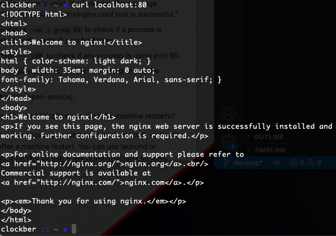
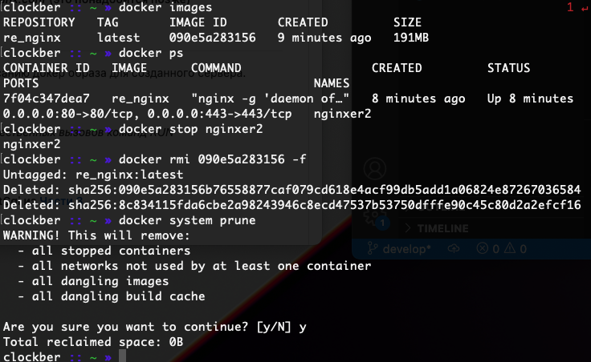
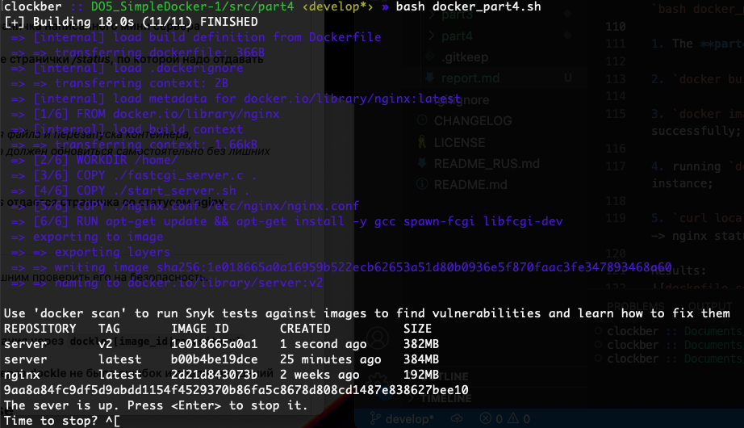

## Part 1

01. `docker pull nginx`  

02. `docker images`  

03. `docker run -d --name nginxer nginx`  

04. `docker ps` (ps like "Process Status")  

05. The info on the nginx container:

    01. IP = 172.17.0.2 (`docker inspect -f '{{range.NetworkSettings.Networks}}{{.IPAddress}}{{end}}' nginxer`)  
    

    02. SIZE = 1095 bytes (`docker inspect --size -f 'RW = {{ .SizeRw }}; ROOTFS = {{ .SizeRootFs }}' nginxer`)  
      
    Also, `docker ps -s`:  
    

    03. List of mapped ports (`docker inspect --type=container -f '{{.NetworkSettings.Ports}}' nginxer`)  
    

06. `docker stop`  

07. `docker ps` after having the container stopped  

08. `docker run -d -p 80:80 -p 443:443 --name nginxer1 nginx`  

09. `docker ps`  

10. Nginx is working at the port 80  

11. Nginx is restarted and works as well, but the name has changed  

## Part 2

1. `docker exec nginxer1 cat /etc/nginx/nginx.conf`.  

2. Copying the basic config file, pasting it in a local config file (see **part2/origin_nginx.conf**) and then enrich it with the \[local\] server configuration. Please refer to the **./part2/nginx.conf** file for details. This file should replace the NGINX configuration in the container. When it is done, reloading the server  

3. Reloading (`docker exec nginxer1 nginx -s reload`) and checking the **localhost:80/status** (`curl localhost:80/status`):  

4. Exporting the container into a **.tar** archive (`docker export nginxer1 > container.tar`)  

5. Stopping containers, removing images and containers - cleansing routine.

6. Importing with `docker import -c 'CMD ["nginx", "-g", "daemon off;"]' ./container.tar re_nginx` and launching the image via `docker run --rm -d -p 80:80 -p 443:443 --name nginxer2 re_nginx`:

## Part 3

The part is to write a "Hello, world!" mini server in C using the FastCGI module.

0. Assuming we are in the **part3** directory and consider to run `bash docker_part3.sh` script.

1. Cleaning up.  

2. `docker pull nginx` - yes, again if needed.

3. Running the nginx container (`docker run --rm -d -p 81:81 --name server nginx`) and then executing the following commands:

    1. `docker exec serv apt update` - checking the system for updates;

    2. `docker exec serv apt upgrade -y` if you want to upgrade your container;

    3. `docker exec serv apt install -y gcc spawn-fcgi libfcgi-dev` - only necessary tools for compiling a FastCGI server;

    4. commiting the changes: `docker commit $CONTAINER_ID [new_image]`  
    

    5. copying the files from the **part3** directory:

        1. `docker cp nginx.conf serv:/etc/nginx/`;

        2. `docker cp fastcgi_server.c serv:/`

    6. `docker exec serv gcc ./fastcgi_server.c -l fcgi -o fcgi_server` - compiling the FastCGI server.

    7. `docker exec serv spawn-fcgi -p 8080 fcgi_server` - launching;

    8. `docker exec serv nginx -s reload` - a new nginx configuration is in effect;

    

4. Executing locally: `curl http://localhost:81/` to behold our server alive.  

## Part 4

0. Assuming we are in the **part4** directory and consider to run `bash docker_part4.sh` script.

1. The **part4** containes necessary files for building a container.

2. `docker build . -t server:v2` - building the image;

3. `docker images` - to be sure that the building has been done successfully;

4. running `docker run --rm -d -p 80:81 --name server2 server:v2` instance;

5. `curl localhost:80` -> "Hello World!", `curl localhost:80/status` -> nginx status.

Results:  

## Part 5

Install the Dockle tool with `brew install goodwithtech/r/dockle` command (see [Dockle](https://github.com/goodwithtech/dockle) project page). For other platforms, please refer to [this post](https://habr.com/ru/companies/timeweb/articles/561378/).

0. In the **part5** directory and consider to run `bash docker_part5.sh` script.

1. `dockle [YOUR_IMAGE_NAME]` - here you may witness problems;

2. Time for the third (3) version of the server container:

    0. stop and clean what you need (`docker system prune -a`);

    1. in the shell: `export DOCKER_CONTENT_TRUST=1`;

    2. `docker build . -t server:v3`;

    3. `dockle -ak NGINX_GPGKEY -ak NGINX_GPGKEY_PATH server:v3`;

    4. in the shell: `export DOCKER_CONTENT_TRUST=0` (see the screenshot with the results below);

    5. `docker run --rm -it -d -p 80:81 --name server3 server:v3` 

    6. `curl localhost:80` - hello, world;

    7. `curl localhost:80/status` - nginx status;

Results:  

## Part 6

0. In the **part6** directory, prepare at least two (2) terminals.

1. In a terminal: `docker-compose up --build`

2. In another terminal: `curl` commands and then `docker-compose stop`

Result:  

Finish.
